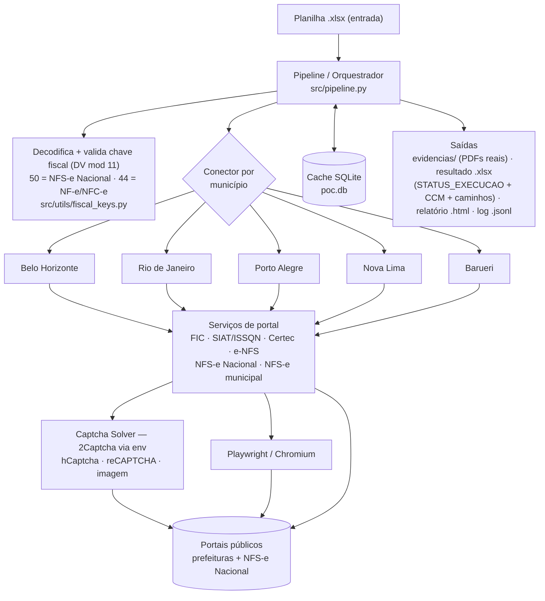

# POC - Automação de CCM + Download de Documentos Fiscais

Automação que, a partir de uma planilha de notas, **descobre a Inscrição Municipal/CCM**,
**baixa o cadastro municipal oficial** da empresa e **baixa a nota fiscal oficial em PDF/XML**,
diretamente nos portais públicos das prefeituras e da NFS-e Nacional.

> **Resultado real da amostra (25 linhas):** **11 SUCESSO · 5 PARCIAL · 9 ERRO**
> Evidências reais já incluídas em [`entrega_final/evidencias/`](entrega_final/evidencias). Testes: **48 passed**.

---

## Arquitetura (visão geral)



**Fluxo por linha:** decodifica/valida a chave → roteia para o conector do município →
o serviço acessa o portal oficial (HTTP puro quando possível, ou Playwright) resolvendo o
captcha via 2Captcha → baixa **cadastro municipal** e **nota fiscal** → o cache evita refazer
trabalho → o pipeline classifica `SUCESSO/PARCIAL/ERRO` e grava planilha, relatório e evidências.

---

## 1. Critério de sucesso

Conforme o enunciado, uma linha só é marcada como **SUCESSO** quando reúne os **três** itens:

1. **Inscrição Municipal / CCM** encontrada;
2. **cadastro municipal oficial** da empresa — em **PDF/XML** ou **print da página de cadastro**
   do portal **oficial do município**;
3. **nota fiscal oficial** baixada em **PDF ou XML**.

**Não** contam como sucesso (são, no máximo, apoio): cadastro federal (ReceitaWS/CNPJa/BrasilAPI),
JSON da chave fiscal decodificada, PDF gerado localmente, screenshot que **não** seja de uma página
oficial de cadastro municipal, documento de **outro** município, ou caso com apenas uma das duas
pontas (só nota **ou** só cadastro).

> Observação: o print só vale quando é da **página oficial de cadastro do município** mostrando a
> empresa correta (CNPJ + Inscrição Municipal). É o caso do print da *Consulta de Prestadores* do
> e-NFS de Nova Lima usado nos casos SALT.

Esse critério é aplicado no código em [`src/pipeline.py`](src/pipeline.py) e coberto por testes
([`tests/test_success_criteria.py`](tests/test_success_criteria.py)).

---

## 2. Destaques técnicos

- **Decodificação das chaves fiscais** ([`src/utils/fiscal_keys.py`](src/utils/fiscal_keys.py)):
  identifica o tipo pelo tamanho/estrutura e valida o **dígito verificador (módulo 11)**.
  - **50 dígitos** → NFS-e Nacional (extrai município IBGE, CNPJ emitente, número, competência);
  - **44 dígitos** → NF-e (modelo 55) ou NFC-e (modelo 65) — **não** são tratadas como NFS-e municipal.
- **Caminho curto da NFS-e Nacional** ([`src/services/nfse_nacional_download.py`](src/services/nfse_nacional_download.py)):
  a Consulta Pública é um formulário sem token anti-forgery, cujo único obstáculo é o **hCaptcha**.
  Todo o fluxo roda em **HTTP puro** (sem navegador): `GET` → resolve hCaptcha → `POST` →
  link oficial `/Download/DANFSe` → baixa o **PDF real da DANFSe**.
- **Conectores por município** ([`src/connectors/`](src/connectors)), cada um com a estratégia do portal real:
  - **Belo Horizonte** — FIC pública (PBH) + BHISS/NFS-e (Playwright + captcha de imagem);
  - **Rio de Janeiro** — Certec (cadastro) + Nota Carioca / NFS-e Nacional;
  - **Porto Alegre** — SIAT/ISSQN (Procempa) com reCAPTCHA + NFS-e Nacional;
  - **Nova Lima** — e-NFS (inscrição) + roteamento para BH quando a chave aponta BH/MG;
  - **Barueri** — ISSNet (bloqueado por Cloudflare 403, documentado).
- **Resolução de captcha** ([`src/services/captcha_solver.py`](src/services/captcha_solver.py)) via **2Captcha**,
  por variável de ambiente: **hCaptcha** (submissão em lote paralelo, tolerante a instabilidade),
  **reCAPTCHA v2** (SIAT POA) e **captcha de imagem** (fallback local com `ddddocr`).
  Falha **rápido** quando a chave é placeholder/inválida — nunca trava o pipeline.
- **Navegação real com Playwright** (Chromium headless) para os portais que exigem browser
  ([`src/browser/playwright_runner.py`](src/browser/playwright_runner.py), `bh_fic.py`, `poa_siat.py`, `rj_certec.py`).
- **Cache idempotente** (SQLite `poc.db` + reuso de PDFs já baixados): re-execuções não refazem
  trabalho concluído e não consomem captcha à toa.
- **Integridade acima de número**: um PDF que vinha de **outro município** (Joaçaba/SC) foi
  **removido** por não comprovar cadastro de Nova Lima. No lugar, os casos SALT usam o **print
  oficial da Consulta de Prestadores do e-NFS Nova Lima** (CNPJ + Inscrição Municipal), aceito
  pelo enunciado — evidência real, não fabricada.
- **Saída auditável**: planilha `.xlsx` com 20+ colunas técnicas, relatório `.html` e evidências em PDF,
  além de log estruturado `.jsonl`.

---

## 3. Stack

| Camada | Tecnologias |
|---|---|
| Linguagem | Python ≥ 3.11 |
| Orquestração/CLI | `typer`, `rich`, `loguru` |
| HTTP | `httpx`, `tenacity` |
| Browser | `playwright` (Chromium) |
| Captcha | 2Captcha (hCaptcha/reCAPTCHA/imagem) + `ddddocr` |
| Dados/planilha | `pydantic`, `openpyxl`, `pandas` |
| Persistência | SQLite (cache de CCM e execuções) |
| Testes/CI | `pytest`, GitHub Actions |
| Container | Docker / docker-compose |

---

## 4. Estrutura do projeto

```
.
├── src/                      # código-fonte
│   ├── main.py               # CLI (typer)
│   ├── pipeline.py           # orquestração + critério de sucesso
│   ├── models.py             # modelos (pydantic)
│   ├── excel_handler.py      # leitura/escrita da planilha
│   ├── report.py             # relatório HTML
│   ├── database.py           # cache SQLite
│   ├── connectors/           # 1 conector por município
│   ├── services/             # FIC, SIAT, Certec, e-NFS, NFS-e Nacional, captcha...
│   ├── browser/              # automação Playwright
│   └── utils/                # chaves fiscais, CNPJ, filesystem
├── tests/                    # 48 testes (pytest)
├── input/                    # planilha de entrada da amostra
├── entrega_final/            # ENTREGA CURADA (ver abaixo)
│   ├── docs/                 # decisoes_tecnicas.md + investigacoes_e_entrega.md
│   ├── resultados/           # planilha final .xlsx + relatório .html
│   └── evidencias/           # PDFs REAIS já baixados (cadastros + notas)
├── pyproject.toml
├── Dockerfile / docker-compose.yml
└── .env.example              # apenas o NOME da variável TWOCAPTCHA_API_KEY
```

### Sobre os arquivos da entrega
- **As evidências reais já estão em [`entrega_final/evidencias/`](entrega_final/evidencias)** — são os
  PDFs oficiais de cadastro municipal e de notas fiscais que o pipeline baixou. O avaliador pode
  **abrir e conferir cada documento sem precisar reexecutar nada**.
- A planilha e o relatório finais estão em [`entrega_final/resultados/`](entrega_final/resultados);
  todos os caminhos de arquivo na planilha apontam para `entrega_final/` e foram auditados
  (0 caminhos quebrados, sem `nan`).
- A documentação técnica detalhada está em [`entrega_final/docs/`](entrega_final/docs).

> ⚠️ **A reexecução do zero depende de fatores externos**: disponibilidade dos **portais públicos**
> no momento da consulta e de uma **chave válida da 2Captcha** fornecida via variável de ambiente.
> Por isso as evidências já vêm prontas na entrega — a reexecução é opcional e pode variar conforme os portais.
>
> Validado: com a chave real e os portais no ar, a pipeline **reproduz os sucessos** — o hCaptcha é
> resolvido e as DANFSe são baixadas. Sem a chave, os passos de captcha **falham rápido** (não travam).

---

## 5. Como conferir a entrega (sem rodar nada)

1. Abra [`entrega_final/resultados/resultado_final_entrega_20260620.xlsx`](entrega_final/resultados) —
   coluna `STATUS_EXECUCAO` (11 SUCESSO / 5 PARCIAL / 9 ERRO) e as colunas `ARQUIVO_*`.
2. Abra o relatório [`entrega_final/resultados/relatorio_final_entrega_20260620.html`](entrega_final/resultados).
3. Navegue por [`entrega_final/evidencias/`](entrega_final/evidencias) e abra os PDFs reais.
4. Leia [`entrega_final/docs/`](entrega_final/docs) para o racional caso a caso.

---

## 6. Como testar do zero (baixar os PDFs e rodar a pipeline)

Requisitos: Python ≥ 3.11 e uma **chave real da 2Captcha**.

```powershell
# 1. instalar dependências (modo editável + dev)
pip install -e ".[dev]"

# 2. instalar o navegador do Playwright
python -m playwright install chromium

# 3. exportar a chave da 2Captcha direto no shell (NUNCA versionar a chave real)
$env:TWOCAPTCHA_API_KEY = "SUA_CHAVE_REAL_DA_2CAPTCHA"

# 4. rodar o pipeline (baixa cadastros + notas e gera planilha/relatório)
python -m src.main input\janabril2026_amostra_5x5.xlsx --output-dir output
```

Equivalente em Linux/macOS (bash):

```bash
pip install -e ".[dev]"
python -m playwright install chromium
export TWOCAPTCHA_API_KEY="SUA_CHAVE_REAL_DA_2CAPTCHA"
python -m src.main input/janabril2026_amostra_5x5.xlsx --output-dir output
```

A execução cria em `output/`:
- `output/evidencias/<MUNICIPIO>/<CNPJ>/...` — cadastros e notas baixados;
- `output/resultado_*.xlsx` e `output/relatorio_*.html`;
- `output/logs/execution_*.jsonl`.

**Notas importantes**
- Se `TWOCAPTCHA_API_KEY` estiver vazia ou for um placeholder, o pipeline **não trava**: ele
  registra o erro técnico na linha e segue (os casos de NFS-e Nacional simplesmente não baixam).
- O pipeline **reaproveita PDFs já existentes** no diretório de saída. Para um teste 100% do zero,
  use um diretório limpo (ex.: `--output-dir output_novo`).
- Os resultados de uma reexecução podem diferir da amostra entregue se algum portal estiver
  indisponível no momento.

### Alternativa com Docker

```powershell
# passe a chave da 2Captcha como variável de ambiente para o container
$env:TWOCAPTCHA_API_KEY = "SUA_CHAVE_REAL_DA_2CAPTCHA"
docker compose run --rm -e TWOCAPTCHA_API_KEY pipeline
```

(O resultado fica no volume `./output`.)

---

## 7. Testes

```powershell
python -m pytest
# 48 passed
```

CI no GitHub Actions ([`.github/workflows/ci.yml`](.github/workflows/ci.yml)) roda a suíte em cada push/PR.

---

## 8. Segurança

- A **chave da 2Captcha nunca é versionada**: vive apenas na variável de ambiente
  `TWOCAPTCHA_API_KEY`. O [`.env.example`](.env.example) traz **somente o nome** da variável.
- Confirmado: a chave real não está em nenhum arquivo do repositório nem no histórico Git.

---

## 9. Documentação detalhada

- [`entrega_final/docs/decisoes_tecnicas.md`](entrega_final/docs/decisoes_tecnicas.md) — arquitetura, estratégias por município e decisões de engenharia.
- [`entrega_final/docs/investigacoes_e_entrega.md`](entrega_final/docs/investigacoes_e_entrega.md) — resultado por linha, casos de sucesso e o porquê de cada PARCIAL/ERRO.
